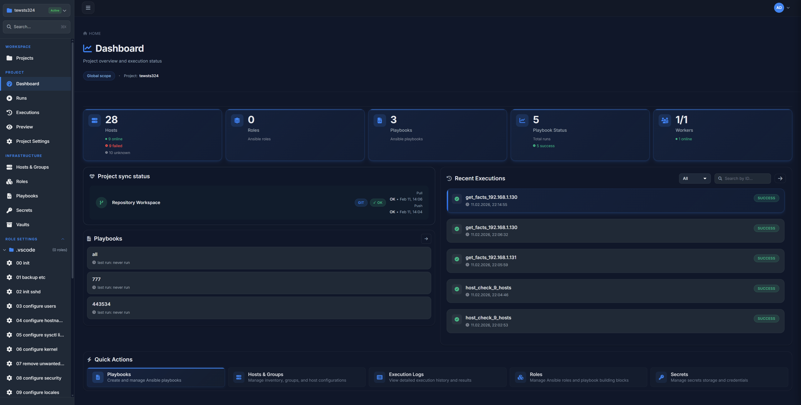
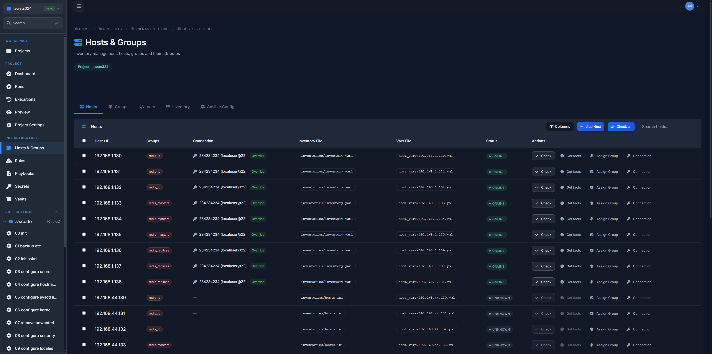
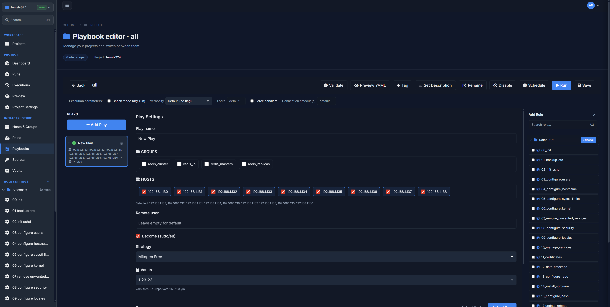
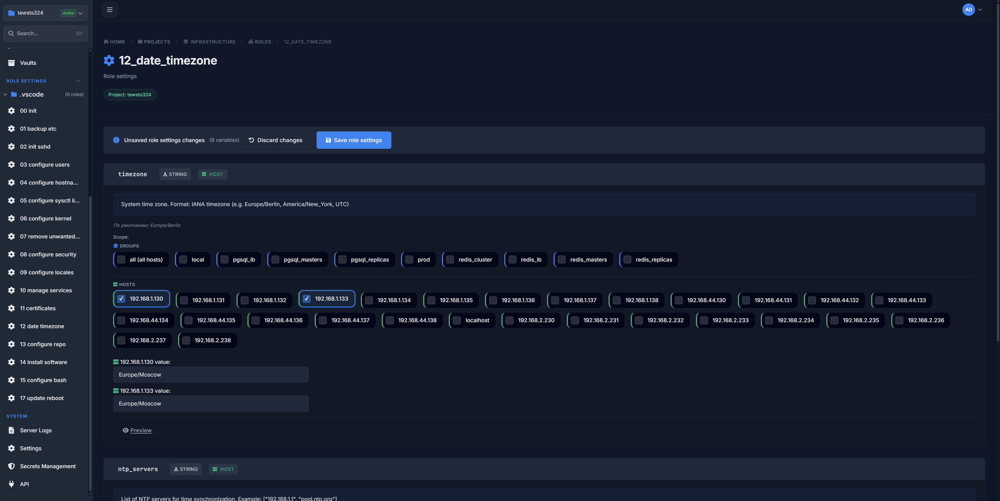
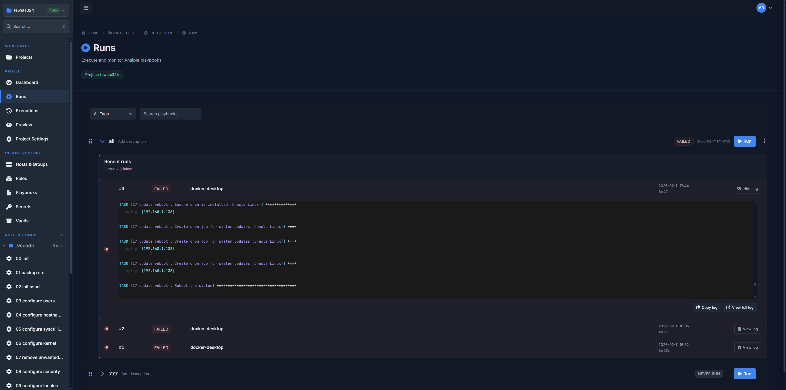
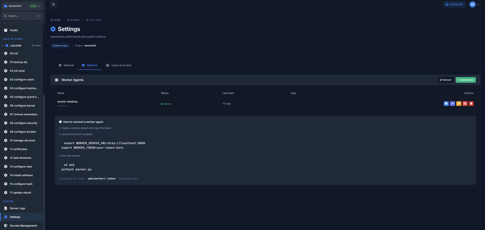

# 🚀 Infrastructure Automation Platform

**A modern UI-driven Infrastructure as Code platform built around Ansible.**  
Design, manage, and execute infrastructure as code — with Git integration, distributed workers, and a built-in scheduler.

---

## 📚 Documentation

**[→ Full documentation](documentation/README.md)** — Docker setup, first login, project quick start, Git sync.

---

## ⚡ Quick Start

```bash
git clone git@github.com:yokozu777/StarGate.git
cd StarGate
docker compose -f docker-compose.hub.yml up -d
```

Open http://localhost:8080 — login: `admin` / `admin123`.

---

## 🔥 What It Is

A **self-hosted Infrastructure as Code management platform designed for large teams**.

It transforms Ansible from a collection of playbooks and YAML files  
into a **managed engineering system** with transparent changes, repeatable executions, and controlled access.

The platform helps teams to:

- bring order to complex infrastructure  
- accelerate change delivery  
- reduce human errors  
- scale IaC across dozens or hundreds of servers  

**This is not just Ansible.**  
**It’s Jenkins for Infrastructure as Code and platform engineers.**

## 🖥 User Interface Overview

### 📊 Dashboard
<p align="center">
  
</p>
Centralized view of infrastructure status, recent runs, and system health.

---

### 🧠 Hosts & Inventory
<p align="center">
  
</p>
Manage hosts, groups, and inventory structure with full visibility into variables and connections.

---

### 🎮 Playbook Editor
<p align="center">
  
</p>
Edit, preview, and execute Ansible playbooks with fine-grained control over execution parameters.

---

### 🧩 Role Configurator (Git-native)
<p align="center">
  
</p>
Load roles from Git, edit them directly in the UI, review diffs, and push changes back to the repository.

---

### ▶️ Runs & Executions
<p align="center">
  
</p>
Track execution history, inspect logs, and monitor playbook runs in real time.

---

### ⚙️ Workers
<p align="center">
  
</p>
Manage execution workers, scale horizontally, and control parallel infrastructure operations.

---

## 🧠 What It Brings Together

- Ansible inventory  
- roles and playbooks  
- host and group variables  
- Git-based workflows  
- task execution and scheduling  
- parallel workers and execution queues  

All combined into a **single visual, manageable, and reproducible interface**,  
built for production environments and collaborative teams.

---

## 🎯 Why Large Teams Need It

As infrastructure grows:

- manual runs become risky  
- YAML stops being “self-explanatory”  
- changes lose auditability  
- different engineers solve the same problems differently  

The platform addresses this by:

- standardizing infrastructure workflows  
- making changes observable and auditable  
- reducing the *bus factor*  
- accelerating *day-2 operations*  
- turning infrastructure into a **predictable product**, not a set of scripts  

---

## ✨ Key Features

### 🧠 Inventory & Variables Management
- Host and group management  
- Host vars and group vars  
- Visual control of variable scope and inheritance  
- Support for comple


---

### 🎮 Playbook Editor
- UI-based playbook editor  
- Target selection by groups or individual hosts  
- Execution parameter control:
  - forks  
  - timeout  
  - verbosity  
  - dry-run  
- Preview the final rendered YAML before execution  

---

### ⚙️ Execution Engine & Workers
- Multiple workers for parallel execution  
- Horizontal scalability under load  
- Project-level task isolation  
- Real-time execution monitoring  

---

### ⏱ Scheduler
- Cron-like task scheduler  
- Recurring playbook executions  
- Automated day-2 operations  
- Repeatable and controlled infrastructure changes  

---

### 🔐 Security & Access
- Centralized access management  
- Controlled `become / sudo` usage  
- Secure SSH handling  
- Project and environment isolation  

---

## 🧩 Typical Use Cases

- Cluster management (Redis, PostgreSQL, service nodes)  
- Server configuration and hardening  
- Backup, restore, and compliance automation  
- Scheduled maintenance  
- CI/CD for infrastructure  
- Day-2 operations  

---

## 🎯 Product Philosophy

> **Infrastructure should be reproducible, auditable, and boring.**  
> This platform makes it visible, manageable, and safe.

---

## 🧠 How It Stands Out

- UI **on top of IaC**, not instead of it  
- Git as the single source of truth  
- No vendor lock-in  
- Full transparency for every change  
- Suitable for both small teams and large production clusters  
